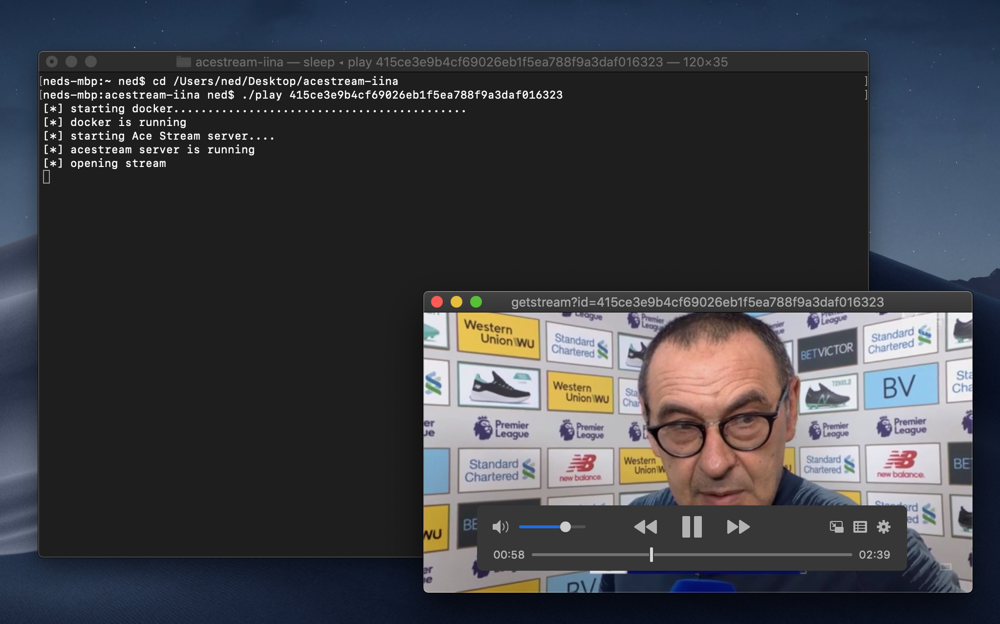

# acestream-iina
Command line script to play Ace Streams on macOS using IINA media player

<p align="center">
	
</p>

## Usage
Run `./play <Acestream ID>` or `./play acestream://<Acestream ID>`.<br>
Use CTRL+C to close.

## Requirements
- [Docker](https://www.docker.com) - Enterprise Application Container Platform
- [IINA](https://iina.io) - The modern media player for macOS

## Make script global (optional)
```
$ cd acestream-iina
$ cp ./play /usr/local/bin
```
Now you can use `play` command from any directory.

## Credits
- [Acestream dockerized image (blaiseio/acestream)](https://hub.docker.com/r/blaiseio/acestream)
- [blaise-io/acelink](https://github.com/blaise-io/acelink)
